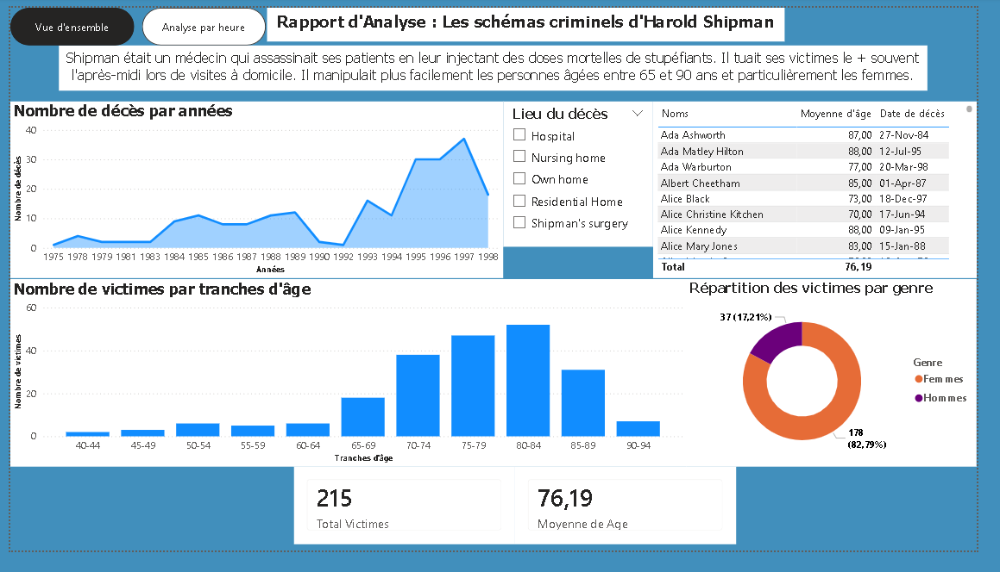
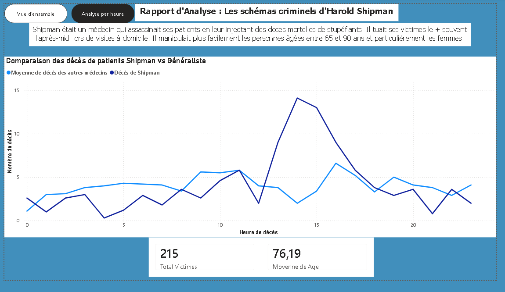

# Analyse de Données Criminelles : Les Schémas Criminels d'Harold Shipman

Ce dépôt contient une analyse de données interactive développée sous **Power BI Desktop**, explorant les schémas criminels du Dr. Harold Shipman (l'un des tueurs en série les plus prolifiques de l'histoire moderne). 

L'objectif de ce projet est de mettre en lumière les anomalies statistiques majeures qui auraient pu mener à son arrestation bien plus tôt, notamment la répartition démographique de ses victimes, ses lieux d'action privilégiés, ainsi que son pic d'activité horaire hautement suspect par rapport à la moyenne nationale.

---

## 📊 Visuels du Tableau de Bord

### 1. Vue d'Ensemble des Données
Ce premier volet présente une synthèse globale des 215 victimes confirmées, l'évolution des décès par année, la répartition par tranches d'âge, le genre, ainsi qu'un filtre interactif par lieu de décès.



### 2. Analyse Temporelle et Horaire
Ce second volet expose la signature chronologique unique de Shipman : une concentration anormale de décès en plein après-midi (lors de ses visites à domicile), contrastant radicalement avec la courbe de mortalité naturelle constatée chez les autres médecins généralistes.



---

## 🗂️ Structure du Dépôt GitHub

```bash
├── README.md                          # Documentation du projet (ce fichier)
├── analyse_dr_death.pbix        # Fichier source Power BI Desktop
├── images/
│   ├── vue_ensemble.png               # Capture d'écran de la page principale
│   └── analyse_horaire.png            # Capture d'écran de la page temporelle
└── data/
    ├── shipman-confirmed-victims.csv  # Base de données nominative des 215 victimes
    └── shipman-times-comparison.csv   # Données comparatives des heures de décès
```

---

## 📈 Insights Principaux Révélés

* **Profil Démographique Ciblé :** Plus de **82%** des victimes étaient des **femmes**, avec une concentration critique sur la tranche d'âge des **70 à 90 ans** (le pic culminant entre 80 et 84 ans).
* **Mode Opératoire (Lieu) :** Les crimes se déroulaient majoritairement **à domicile** (*Own home*), profitant de l'isolement des patientes lors de consultations à première vue routinières.
* **L'Anomalie Horaire Majeure (Le Pic de 14h) :** Alors que la mortalité standard chez un médecin généraliste témoin suit une courbe globalement stable et plate tout au long des 24 heures (entre 2 et 5 décès en moyenne), les décès sous la responsabilité de Shipman grimpent en flèche dès la fin de matinée pour atteindre un **sommet critique de 14 décès à 14h00**, heure correspondant exactement à ses tournées à domicile.

---

## 🛠️ Technologies Utilisées & Compétences Clés

* **Power BI Desktop :** Modélisation de données, conception de l'interface utilisateur (UI/UX) et mise en page du tableau de bord.
* **Power Query (M) :** Nettoyage des données, transformation, traduction des variables qualitatives (ex: *gender* traduit en Hommes/Femmes) et gestion des filtres contextuels.
* **DAX (Data Analysis Expressions) :** Création de mesures calculées dynamiques (ex: calcul distinct du volume total de victimes et calcul de la moyenne d'âge globale).
* **Storytelling & Navigation :** Implémentation d'un système de navigation fluide et ergonomique basé sur des **Signets (Bookmarks)** et des volets de sélection pour basculer dynamiquement entre les analyses sans surcharger l'espace visuel.

---

## 🚀 Comment Utiliser ce Projet

1. **Prérequis :** Installez [Power BI Desktop](https://powerbi.microsoft.com/) (gratuit).
2. **Cloner le projet :**
   ```bash
   git clone [https://github.com/VOTRE_USERNAME/NOM_DU_REPOSITORIE.git](https://github.com/VOTRE_USERNAME/NOM_DU_REPOSITORIE.git)
   ```
3. **Ouvrir le rapport :** Lancez le fichier `Analyse_Harold_Shipman.pbix`.
4. **Interactivité :** Utilisez les boutons de navigation en haut à gauche pour naviguer entre la **Vue d'ensemble** et l'**Analyse par heure**, et cliquez sur les graphiques ou les segments (comme le lieu de décès) pour filtrer dynamiquement l'ensemble des indicateurs.
